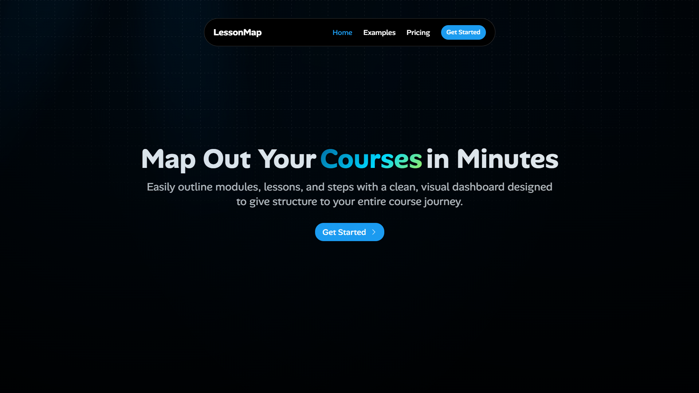

# LessonMap – Course Outline Builder SaaS

LessonMap is a SaaS platform that helps creators map out their courses, lessons, and modules in minutes. With a clean, visual dashboard, users can design structured course outlines that can be shared, exported, or integrated into their own online learning platforms.

## 🚀 Features

-  Outline Builder – Drag-and-drop interface to create structured course outlines.
-  Phases & Lessons – Organize content into phases, steps, and lessons for clarity.
-  Sharable Pages – Each outline has a unique link for easy sharing or embedding.
-  Export Options – Download outlines as PDF
-  Freemium + Subscription Model: